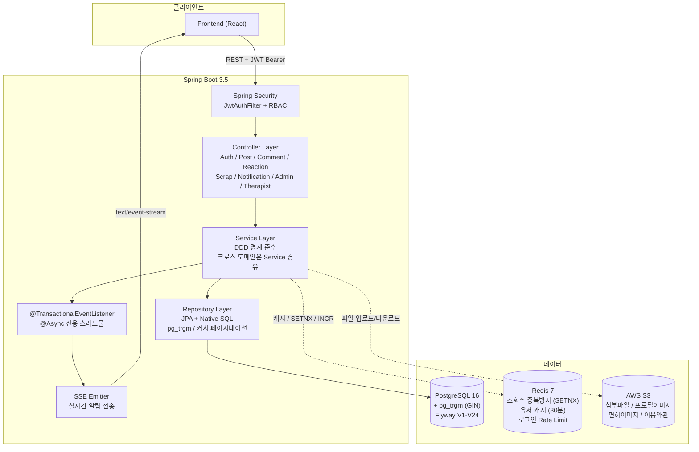
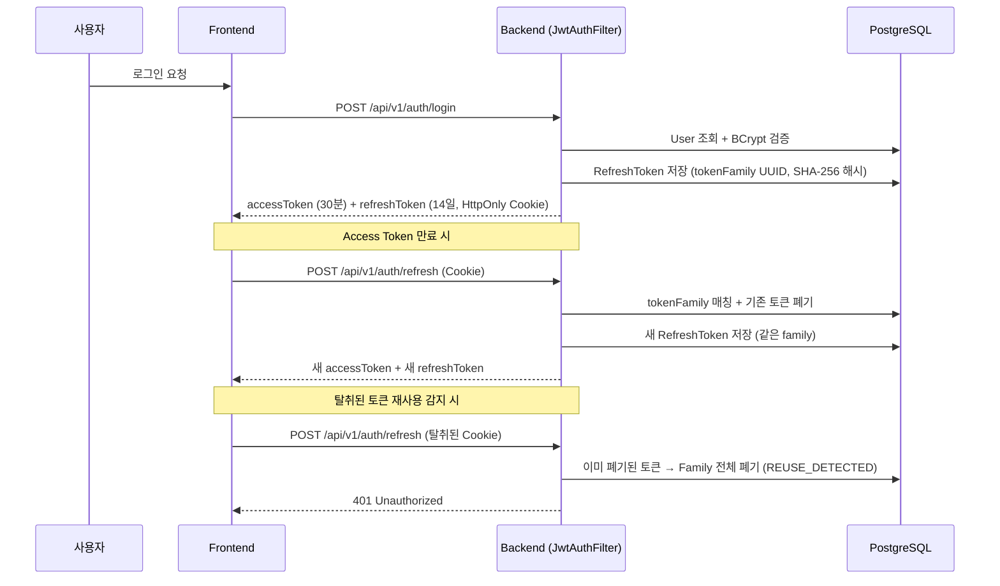
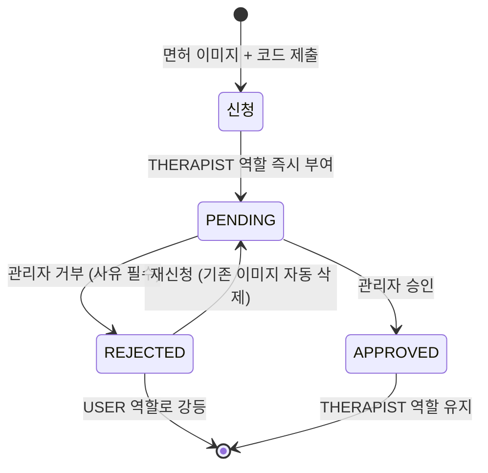

<div align="center">

# MellonMe

### 치료사 전용 커뮤니티 플랫폼


</div>

---

## 목차

1. [프로젝트 소개](#1-프로젝트-소개)
2. [아키텍처](#2-아키텍처)
3. [전체 기능 목록](#3-전체-기능-목록)
4. [핵심 기능 상세](#4-핵심-기능-상세)
5. [역할 기반 접근 제어](#5-역할-기반-접근-제어)
6. [API 엔드포인트 전체 목록](#6-api-엔드포인트-전체-목록)
7. [기술적 의사결정](#7-기술적-의사결정)
8. [Quick Start](#8-quick-start)
9. [프로젝트 문서](#9-프로젝트-문서)

---

## 1. 프로젝트 소개

MellonMe는 치료사 전용 커뮤니티 플랫폼의 백엔드 REST API 서버입니다.

치료사 면허 인증을 통해 검증된 전문가만 커뮤니티에 참여할 수 있으며, 게시글 작성/검색, 첨부파일 공유, 실시간 알림, 반응/스크랩 등 커뮤니티에 필요한 전체 기능을 제공합니다.

### 기술 스택

| 분류 | 기술 |
|------|------|
| **Framework** | Spring Boot 3.5, Spring Security, Spring Data JPA, Spring Data Redis |
| **Language** | Java 17 |
| **Database** | PostgreSQL 16 (pg_trgm 확장), H2 (테스트) |
| **Cache** | Redis 7 |
| **Auth** | JWT (HS256) — Access Token 30분, Refresh Token 14일 (HttpOnly Cookie) |
| **Migration** | Flyway (V1 ~ V24) |
| **File Storage** | AWS S3 (prod) / Local FileSystem (dev) |
| **API Docs** | springdoc-openapi 2.8.5 (Swagger UI) |
| **Build** | Gradle |

---

## 2. 아키텍처

### 2-1. 시스템 구성도



### 2-2. 도메인 모듈 구조 (13개 모듈)

```
com.therapyCommunity_Vol1.backend
├── auth/          회원가입, 로그인, JWT 발급, Refresh Token Family Rotation
├── user/          프로필, 역할 관리 (USER -> THERAPIST 승격), Redis 캐시
├── post/          게시글 CRUD, 이미지/첨부파일, 관련도 검색, 인기순 피드, 조회수
├── comment/       스레드형 댓글 (최대 2depth), 소프트 삭제
├── reaction/      확장형 반응 (게시글: 공감/감사/유익, 댓글: 좋아요/싫어요)
├── scrap/         게시글 북마크
├── notification/  SSE 실시간 알림 (8가지 타입), 유실 이벤트 복구
├── therapist/     치료사 면허 인증 신청, 재신청 워크플로우
├── admin/         관리자 인증 심사 (승인/거부), 면허 이미지 조회
├── application/   MyPage 파사드 (user + post + comment + download 집계)
├── file/          파일 저장소 추상화 (S3 prod / Local dev)
├── meta/          홈 헬스체크, 이용약관 (S3 Presigned URL)
└── global/        Security, Cache, Exception, BaseEntity, ApiResponse, CORS
```

---

## 3. 전체 기능 목록

### 인증 (Auth)
- 이메일/비밀번호 회원가입 (자동 닉네임 생성, 약관 동의 버전 관리)
- 로그인 / 로그아웃
- JWT Access Token 발급 (HS256, 30분)
- Refresh Token Family Rotation (14일, HttpOnly Cookie, SHA-256 해시 저장)
- 토큰 탈취 감지 시 Family 전체 폐기 (Reuse Detection)
- Redis 기반 로그인 실패 Rate Limiting (10회 실패 시 30분 잠금)
- IP/UserAgent 기록을 통한 이상 접근 탐지 기반 확보
- 탈퇴 회원 토큰 전체 폐기

### 사용자 (User)
- 내 정보 조회 (치료사 인증 상태 포함)
- 프로필 수정 (닉네임 2~20자, 중복 검사)
- 프로필 이미지 업로드 (jpg/png/webp, 5MB 제한)
- 회원 탈퇴 (소프트 삭제, 토큰 폐기)
- Redis 캐시 (Cache-Aside, TTL 30분 + jitter, null 캐싱으로 cache penetration 방지)

### 게시글 (Post)
- 게시글 CRUD (소프트 삭제)
- 게시글 타입: COMMUNITY (일반) / RESOURCE (첨부파일 포함 시 자동 전환)
- 공개 범위: PUBLIC (전체) / PRIVATE (THERAPIST 이상만 접근)
- 치료 분야 태그: 감각통합, 언어, 작업, 인지, 물리, 미술, 음악, 놀이, 행동 치료
- 연령대 태그: 0-2세, 3-5세, 6-12세, 13-18세, 19-64세, 65세 이상
- 이미지 업로드 (jpg/png/webp, 5MB, 순서 관리)
- PDF 첨부파일 업로드/다운로드 (10MB, 헤더 검증)
- 다운로드 이력 추적 (최초/최근 다운로드 시각, 누적 횟수)
- 내가 다운로드한 게시글 목록 조회
- 조회수 (Redis SETNX 기반 사용자당 30분 중복 방지)
- 키워드 검색 (LIKE, SQL Injection 방지 이스케이프)
- 필터링 (치료 분야, 게시글 타입)
- 정렬: 최신순 / 조회수순
- 커서 기반 무한스크롤 피드 (Base64 인코딩 커서)
- 오프셋 기반 페이지네이션 (목록)
- HTML 태그 제거 + 200자 미리보기 자동 생성

### 관련도 검색 (pg_trgm)
- PostgreSQL pg_trgm 확장 + GIN 인덱스 기반 관련도 검색
- title + content + therapyArea + ageGroup 통합 search_text 컬럼
- similarity 점수 + ILIKE 병렬 조건 (유사도 낮아도 정확 매칭 포함)
- numeric(10,8) 캐스팅으로 부동소수점 오차 방지
- SET LOCAL로 similarity_threshold 트랜잭션 스코프 설정
- 2단계 Fetch: ID+score 조회 후 author 포함 fetch (N+1 방지)
- (lastScore, lastId) 커서 페이지네이션

### 인기순 피드
- 인기도 점수: `reactions * 30 + scraps * 20 + (epoch / 8640)`
- Long 타입 10배 스케일로 부동소수점 오차 방지
- (popularityScore DESC, id DESC) 복합 커서 무한스크롤
- 반응/스크랩 토글 시 실시간 점수 재계산
- DDD 경계 준수: reaction/scrap 서비스 -> PostService 위임

### 댓글 (Comment)
- 댓글 CRUD (소프트 삭제)
- 스레드형 대댓글 (최대 2depth)
- 삭제된 댓글 "삭제된 댓글입니다" 플레이스홀더 표시
- 댓글 작성 시 게시글 작성자에게 알림 발행
- 대댓글 작성 시 부모 댓글 작성자에게 알림 발행
- 게시글 공개범위에 따른 접근 제어

### 반응 (Reaction)
- **게시글 반응** 3종: 공감(EMPATHY), 감사(APPRECIATE), 유익(HELPFUL)
  - 각 반응별 색상 토큰, 표시 순서 정의
  - 토글 방식 (없음 -> 생성, 동일 -> 삭제, 다른 타입 -> 변경)
  - GROUP BY 쿼리로 전체 반응 통계 한번에 조회
  - 최다 반응 타입 자동 계산 (동점 시 displayOrder로 결정)
- **댓글 반응** 2종: 좋아요(LIKE), 싫어요(DISLIKE)
  - 동일한 토글 방식
- 반응 토글 시 인기도 점수 재계산 + 알림 발행

### 스크랩 (Scrap)
- 게시글 북마크 추가/삭제 (멱등성 보장)
- 스크랩 상태 조회
- 내가 스크랩한 게시글 목록 (페이지네이션)
- 게시글 목록에서 isScrapped 플래그 일괄 조회 (배치 쿼리)
- 스크랩 토글 시 인기도 점수 재계산 + 알림 발행

### 실시간 알림 (Notification)
- SSE (Server-Sent Events) 기반 실시간 푸시
- 8가지 알림 타입:
  - NEW_COMMENT — 내 게시글에 댓글
  - NEW_REPLY — 내 댓글에 대댓글
  - NEW_POST_REACTION — 내 게시글에 반응
  - NEW_COMMENT_REACTION — 내 댓글에 반응
  - NEW_SCRAP — 내 게시글 스크랩
  - VERIFICATION_SUBMITTED — 치료사 인증 제출됨
  - VERIFICATION_APPROVED — 치료사 인증 승인
  - VERIFICATION_REJECTED — 치료사 인증 거부
- 다중 탭 동시 지원 (사용자당 여러 SseEmitter 관리)
- Last-Event-ID 기반 유실 이벤트 자동 복구
- 이벤트 캐시 (사용자당 최대 50개, TTL 30분, 5분 주기 정리)
- @TransactionalEventListener(AFTER_COMMIT) + @Async 비동기 처리
- 전용 스레드풀 (core 2, max 4, queue 100, CallerRunsPolicy)
- 알림 목록 조회 (페이지네이션)
- 미읽은 알림 수 조회
- 단건/전체 읽음 처리
- 알림 삭제

### 치료사 인증 (Therapist)
- 면허 이미지 + 면허 코드로 인증 신청 (multipart/form-data)
- 신청 즉시 THERAPIST 역할 부여 (심사 전 커뮤니티 접근 허용)
- 면허 코드 중복 검사
- 거부 후 재신청 지원 (기존 이미지 자동 삭제)
- 내 인증 상태 조회
- 내 면허 이미지 다운로드
- 트랜잭션 커밋 후 파일 삭제 스케줄링 (orphan 파일 방지)

### 관리자 (Admin)
- 인증 신청 목록 조회 (상태별 필터링: PENDING/APPROVED/REJECTED)
- 인증 승인 (PENDING -> APPROVED)
- 인증 거부 + 사유 입력 (PENDING -> REJECTED, USER 역할로 강등)
- 면허 이미지 조회

### 마이페이지 (MyPage)
- 현재 사용자 정보 조회 (치료사 인증 상태 포함)
- 내가 쓴 게시글 목록 (페이지네이션)
- 내가 쓴 댓글 목록 (삭제된 댓글 포함, 페이지네이션)
- 내가 다운로드한 게시글 목록 (페이지네이션)
- 내가 스크랩한 게시글 목록 (페이지네이션)
- 프로필 이미지 업로드/수정
- 닉네임 변경 (중복 검사)
- 회원 탈퇴

### 파일 저장소 (File)
- FileStorageService 인터페이스 + 환경별 구현체 자동 전환
  - `LocalFileStorageService` — local, dev 프로필
  - `S3FileStorageService` — prod 프로필 (`app.aws.enabled=true`)
- 파일 종류별 디렉토리 분리: `therapist-verifications/`, `post-attachments/`, `profile-images/`
- UUID 기반 파일 이름 생성 (사용자 입력 배제)
- 파일 검증: 확장자, MIME 타입, 크기 제한, magic number 검사
- Path Traversal 방지

### 이용약관 (Meta)
- 서비스 이용약관 / 개인정보처리방침 URL 조회
- S3 Presigned URL 발급 (10분 유효, AWS 비활성 시 직접 URL 폴백)
- 헬스체크 엔드포인트

### 인프라 (Global)
- JWT 인증 필터 (Authorization 헤더 + SSE query parameter 지원)
- 역할 기반 접근 제어 (SecurityConfig 필터 체인)
- CORS 설정 (localhost:3000, localhost:5173)
- 중앙 집중 예외 처리 (GlobalExceptionHandler, 29개 ErrorCode)
- 통일된 응답 포맷: `ApiResponse.success(data)` / `ErrorResponse`
- 페이지네이션: PagedResponse (오프셋) / CursorPagedResponse (커서)
- BaseEntity (createdAt, updatedAt JPA 감사)
- Redis 유저 캐시 (Cache-Aside, TTL 30분 + jitter, null 캐싱)
- BCrypt 비밀번호 해싱
- Swagger/OpenAPI 3.0 (Bearer JWT 보안 스킴)
- Flyway 마이그레이션 (V1 ~ V24)

---

## 4. 핵심 기능 상세

### 4-1. 인증 플로우 (JWT + Refresh Token Family Rotation)



- **Family 기반 Rotation**: 같은 기기/세션의 토큰을 `tokenFamily` UUID로 추적, 탈취 감지 시 family 전체 폐기
- **SHA-256 해시 저장**: DB에 원본 토큰 대신 해시만 저장
- **IP/UserAgent 기록**: 이상 접근 탐지 기반 데이터 확보
- **토큰 폐기 사유 추적**: ROTATED, REUSE_DETECTED, EXPIRED, LOGOUT, WITHDRAW

### 4-2. 관련도 검색 (pg_trgm + GIN 인덱스)

Elasticsearch 없이 **PostgreSQL pg_trgm 확장**만으로 관련도 기반 검색 파이프라인을 구축했습니다.

```sql
-- 통합 검색 컬럼 (title + content 앞 100자 + therapyArea 한글 + ageGroup 한글)
CREATE INDEX idx_therapy_posts_search_text_trgm
    ON therapy_posts USING GIN (search_text gin_trgm_ops);

-- 관련도 점수 + ILIKE 병렬 조건
SELECT p.id, CAST(similarity(p.search_text, :keyword) AS numeric(10,8)) AS score
FROM therapy_posts p
WHERE p.deleted_at IS NULL
  AND (p.search_text % :keyword OR p.search_text ILIKE '%' || :escapedKeyword || '%')
ORDER BY score DESC, p.id DESC
```

| 설계 포인트 | 내용 |
|------------|------|
| **similarity + ILIKE 병렬** | trigram 유사도가 낮아도 정확한 부분 매칭은 검색 결과에 포함 |
| **numeric(10,8) 캐스팅** | 부동소수점 오차 방지 — BigDecimal 커서 동등비교 정확성 보장 |
| **SET LOCAL** | `pg_trgm.similarity_threshold = 0.03` 트랜잭션 스코프 설정 — 전역 오염 회피 |
| **2단계 Fetch** | 1단계: native SQL로 (ID, score)만 조회 — 2단계: author 포함 fetch (N+1 회피) |
| **커서 페이지네이션** | `(lastScore, lastId)` 쌍으로 무한스크롤 지원 |

### 4-3. 인기순 피드

반응/스크랩 가중치 기반 **인기도 점수**를 실시간 갱신하고, 커서 기반 페이지네이션으로 무한스크롤을 제공합니다.

```
popularityScore = reactions * 30 + scraps * 20 + (created_at epoch / 8640)
```

| 설계 포인트 | 내용 |
|------------|------|
| **Long 타입 + 10배 스케일** | 부동소수점 커서 동등비교 오차 방지 (원래 3/2/86400 -> 30/20/8640) |
| **복합 커서** | `(popularityScore DESC, id DESC)` — 동점 시 최신 글 우선 |
| **실시간 갱신** | 반응/스크랩 토글 시 `recalculatePopularityScore()` 즉시 호출 |
| **DDD 경계 준수** | reaction/scrap 서비스 -> `PostService.recalculatePopularityScore()` 위임 |
| **flushAutomatically** | `@Modifying(flushAutomatically = true)` — delete 후 COUNT 서브쿼리가 이전 값을 읽는 문제 방지 |

### 4-4. SSE 실시간 알림

```
반응/댓글/스크랩 서비스
  -> ApplicationEventPublisher.publishEvent(NotificationEvent)
    -> @TransactionalEventListener(AFTER_COMMIT)
      -> @Async("notificationExecutor") 전용 스레드풀
        -> DB 저장 + SSE 전송 + 이벤트 캐시
```

| 설계 포인트 | 내용 |
|------------|------|
| **다중 탭 지원** | `ConcurrentHashMap<userId, ConcurrentHashMap<emitterId, SseEmitter>>` |
| **유실 이벤트 복구** | `Last-Event-ID` 헤더 기반 재연결 시 누락 이벤트 자동 재전송 |
| **이벤트 캐시** | 사용자당 최대 50개, TTL 30분, 5분 주기 정리 |
| **AFTER_COMMIT** | 트랜잭션 롤백 시 알림 미발송 보장 |

### 4-5. Redis 활용 패턴

프로젝트 전체에서 일관된 Redis 사용 패턴을 유지합니다.

| 용도 | Key 패턴 | TTL | 전략 |
|------|----------|-----|------|
| **조회수 중복 방지** | `post_view:{postId}:{userId}` | 30분 | SETNX — 키 없으면 조회수 증가, 있으면 무시 |
| **로그인 Rate Limit** | `login_failed:{email}` | 30분 | INCR — 10회 초과 시 계정 잠금 |
| **유저 캐시** | `user:{userId}` | 30분 + jitter | Cache-Aside — null 캐싱으로 penetration 방지 |

모든 Redis 연동은 **장애 시 가용성 우선** (graceful degradation) — Redis 다운 시 기능이 차단되지 않고 DB 직접 조회 또는 기능 허용으로 폴백합니다.

### 4-6. 치료사 인증 워크플로우



---

## 5. 역할 기반 접근 제어

| 기능 | USER | THERAPIST | ADMIN |
|------|:----:|:---------:|:-----:|
| 회원가입 / 로그인 / 토큰 갱신 | O | O | O |
| PUBLIC 게시글 조회 | O | O | O |
| PRIVATE 게시글 조회 / 작성 | X | O | O |
| 댓글 작성 / 수정 / 삭제 | O | O | O |
| 반응 토글 (게시글 / 댓글) | O | O | O |
| 스크랩 추가 / 삭제 | O | O | O |
| 첨부파일 업로드 / 다운로드 | O | O | O |
| 치료사 인증 신청 | O | O | X |
| SSE 알림 구독 / 조회 | O | O | O |
| 마이페이지 (프로필, 내 글/댓글) | O | O | O |
| 회원 탈퇴 | O | O | O |
| 인증 심사 (승인 / 거부) | X | X | O |
| 관리자 API | X | X | O |

---

## 6. API 엔드포인트 전체 목록

### Auth (`/api/v1/auth`)

| Method | Endpoint | 설명 | 인증 |
|--------|----------|------|:----:|
| POST | `/signup` | 회원가입 (자동 로그인 + 닉네임 생성) | X |
| POST | `/login` | 로그인 (Rate Limiting 적용) | X |
| POST | `/refresh` | Access Token 갱신 (Cookie 기반) | X |
| POST | `/logout` | 로그아웃 (토큰 폐기 + 쿠키 만료) | X |

### MyPage (`/api/v1/me`)

| Method | Endpoint | 설명 | 인증 |
|--------|----------|------|:----:|
| GET | `/` | 내 정보 조회 (치료사 인증 상태 포함) | O |
| PATCH | `/` | 프로필 수정 (닉네임, 프로필 이미지 URL) | O |
| DELETE | `/` | 회원 탈퇴 | O |
| POST | `/profile-image` | 프로필 이미지 업로드 (multipart) | O |
| GET | `/profile-image/profile-images/{filename}` | 프로필 이미지 다운로드 | X |
| GET | `/posts` | 내가 쓴 게시글 목록 | O |
| GET | `/comments` | 내가 쓴 댓글 목록 | O |
| GET | `/scraps` | 내가 스크랩한 게시글 목록 | O |
| GET | `/downloads` | 내가 다운로드한 게시글 목록 | O |

### Post (`/api/v1/posts`)

| Method | Endpoint | 설명 | 인증 |
|--------|----------|------|:----:|
| POST | `/` | 게시글 작성 | O |
| GET | `/feed` | 무한스크롤 피드 (커서 페이지네이션) | O |
| GET | `/` | 게시글 목록/검색 (오프셋 페이지네이션) | O |
| GET | `/{postId}` | 게시글 상세 (조회수 자동 증가) | O |
| PATCH | `/{postId}` | 게시글 수정 (작성자/관리자) | O |
| DELETE | `/{postId}` | 게시글 삭제 (작성자/관리자, 소프트 삭제) | O |

### Post Image (`/api/v1/posts/{postId}/images`)

| Method | Endpoint | 설명 | 인증 |
|--------|----------|------|:----:|
| POST | `/` | 이미지 업로드 (jpg/png/webp, 5MB) | O |
| GET | `/` | 게시글 이미지 목록 | O |
| GET | `/{imageId}` | 이미지 다운로드 | O |

### Post Attachment (`/api/v1/posts/{postId}/attachments`)

| Method | Endpoint | 설명 | 인증 |
|--------|----------|------|:----:|
| POST | `/` | 첨부파일 업로드 (PDF, 10MB) | O |
| GET | `/{attachmentId}/download` | 첨부파일 다운로드 (이력 자동 기록) | O |
| DELETE | `/{attachmentId}` | 첨부파일 삭제 | O |

### Comment (`/api/v1`)

| Method | Endpoint | 설명 | 인증 |
|--------|----------|------|:----:|
| GET | `/posts/{postId}/comments` | 댓글 목록 (스레드 구조) | O |
| POST | `/posts/{postId}/comments` | 댓글/대댓글 작성 | O |
| PATCH | `/comments/{commentId}` | 댓글 수정 (작성자/관리자) | O |
| DELETE | `/comments/{commentId}` | 댓글 삭제 (소프트 삭제) | O |

### Reaction (`/api/v1`)

| Method | Endpoint | 설명 | 인증 |
|--------|----------|------|:----:|
| GET | `/posts/{postId}/reaction` | 게시글 반응 상태 + 통계 | O |
| PUT | `/posts/{postId}/reaction` | 게시글 반응 토글 (생성/삭제/변경) | O |
| GET | `/comments/{commentId}/reaction` | 댓글 반응 상태 | O |
| PUT | `/comments/{commentId}/reaction` | 댓글 반응 토글 | O |

### Scrap (`/api/v1`)

| Method | Endpoint | 설명 | 인증 |
|--------|----------|------|:----:|
| GET | `/posts/{postId}/scrap` | 스크랩 상태 조회 | O |
| POST | `/posts/{postId}/scrap` | 스크랩 추가 | O |
| DELETE | `/posts/{postId}/scrap` | 스크랩 삭제 | O |

### Notification (`/api/v1/notifications`)

| Method | Endpoint | 설명 | 인증 |
|--------|----------|------|:----:|
| GET | `/subscribe` | SSE 구독 (text/event-stream, 30분 타임아웃) | O |
| GET | `/` | 알림 목록 조회 (페이지네이션) | O |
| GET | `/unread-count` | 미읽은 알림 수 | O |
| PATCH | `/{notificationId}/read` | 단건 읽음 처리 | O |
| PATCH | `/read-all` | 전체 읽음 처리 | O |
| DELETE | `/{notificationId}` | 알림 삭제 | O |

### Therapist Verification (`/api/v1/therapist-verifications`)

| Method | Endpoint | 설명 | 인증 |
|--------|----------|------|:----:|
| POST | `/` | 치료사 인증 신청 (multipart: 면허 이미지 + 코드) | O |
| GET | `/me` | 내 인증 상태 조회 | O |
| GET | `/me/image` | 내 면허 이미지 다운로드 | O |

### Admin (`/api/v1/admin/therapist-verifications`)

| Method | Endpoint | 설명 | 인증 |
|--------|----------|------|:----:|
| GET | `/` | 인증 신청 목록 (상태별 필터링) | ADMIN |
| POST | `/{verificationId}/approve` | 인증 승인 | ADMIN |
| POST | `/{verificationId}/reject` | 인증 거부 (사유 필수) | ADMIN |
| GET | `/{verificationId}/image` | 면허 이미지 조회 | ADMIN |

### Meta (`/api/v1`)

| Method | Endpoint | 설명 | 인증 |
|--------|----------|------|:----:|
| GET | `/home` | 헬스체크 | X |
| GET | `/terms/service` | 서비스 이용약관 URL | X |
| GET | `/terms/privacy` | 개인정보처리방침 URL | X |

---

## 7. 기술적 의사결정

| 결정 | 선택 | 이유 |
|------|------|------|
| 관련도 검색 | pg_trgm + GIN | Elasticsearch 없이 추가 인프라 비용 0으로 텍스트 통합 검색 |
| 인기도 점수 타입 | Long (10배 스케일) | 부동소수점 커서 동등비교 오차 방지 + DB 인덱스 성능 |
| 알림 전송 | SSE (Server-Sent Events) | WebSocket 대비 단방향으로 충분, 구현 간결, HTTP/2 호환 |
| 조회수 중복방지 | Redis SETNX + TTL | 세션/쿠키 불필요, Stateless 유지, 30분 자동 만료 |
| Refresh Token | Family Rotation + SHA-256 | 토큰 탈취 시 family 전체 폐기로 피해 최소화 |
| 도메인 간 통신 | Service 위임 (DDD 경계) | Repository 직접 접근 금지 — 도메인 결합도 최소화 |
| 파일 저장소 | 인터페이스 추상화 (S3/Local) | 환경별 자동 전환, 테스트 용이성 |
| 캐시 전략 | Cache-Aside + null 캐싱 + jitter | cache penetration/avalanche 방지, Redis 장애 시 graceful degradation |
| 비동기 알림 | @TransactionalEventListener + @Async | 트랜잭션 안전성 + 요청 스레드 비차단 |

---

## 8. Quick Start

### 사전 준비

- Java 17+
- Docker Desktop (Windows: WSL2 백엔드 권장)

### 인프라만 실행 (DB + Redis)

IDE에서 `bootRun`으로 개발할 때:
```bash
cp .env.example .env
docker compose up -d
```

### 애플리케이션 실행

```bash
./gradlew bootRun --args='--spring.profiles.active=local'
```

### 전체 실행 (Docker only, JDK 불필요)

```bash
cp .env.example .env
docker compose --profile full up --build
```

### 빌드 & 테스트

```bash
./gradlew clean build
./gradlew test
```

### 접속 정보

| 서비스 | URL |
|--------|-----|
| API | http://localhost:8080 |
| Swagger UI | http://localhost:8080/swagger-ui/index.html |
| OpenAPI JSON | http://localhost:8080/v3/api-docs |
| PostgreSQL | localhost:55432 (builders/builders) |
| Redis | localhost:6379 |

### 인증 방식

```
Authorization: Bearer <accessToken>
```

- Refresh Token은 HttpOnly Cookie로 자동 관리
- 치료사 인증 신청 API는 `multipart/form-data` 사용
- 이미지/파일 다운로드 API는 JSON이 아닌 binary 응답
- SSE 구독은 query parameter로 토큰 전달 지원

### 데이터 초기화

```bash
docker compose down -v
```

---

## 9. 프로젝트 문서

| 분류 | 문서 | 설명 |
|------|------|------|
| **아키텍처** | [ARCHITECTURE.md](docs/architecture/ARCHITECTURE.md) | 레이어 구조, 요청 흐름, 주요 컴포넌트 |
| | [FILE_STRUCTURE.md](docs/architecture/FILE_STRUCTURE.md) | 전체 패키지 트리, 네이밍 패턴 |
| | [DECISIONS.md](docs/architecture/DECISIONS.md) | 도메인별 설계 결정 이유 |
| | [CONVENTIONS.md](docs/architecture/CONVENTIONS.md) | 코딩 컨벤션 (엔티티, 서비스, DTO 규칙) |
| **API** | [API_SPEC.md](docs/api/API_SPEC.md) | 엔드포인트 명세 |
| | [API_RULES.md](docs/api/API_RULES.md) | API 설계 규칙 (URL 패턴, 응답 형식, 페이지네이션) |
| | [openapi.json](docs/api/openapi.json) | springdoc 자동 생성 OpenAPI 3.1 스펙 |
| **운영** | [CLOUD_HANDOFF_PACKAGE.md](docs/ops/CLOUD_HANDOFF_PACKAGE.md) | 클라우드 배포 (systemd, Nginx, CloudWatch) |
| | [SERVER_CHECK_RUNBOOK.md](docs/ops/SERVER_CHECK_RUNBOOK.md) | 서버 점검 및 장애 구분 절차 |
| | [BRANCH_OPERATIONS_GUIDE.md](docs/ops/BRANCH_OPERATIONS_GUIDE.md) | 브랜치 운영 규칙 |
| **기획** | [정책 결정](docs/product/therapist_community_policy_decisions.md) | 서비스 정책 결정 배경 |
| **인수인계** | [FRONTEND_HANDOFF.md](docs/handoff/FRONTEND_HANDOFF.md) | 프론트엔드 전달 문서 |
