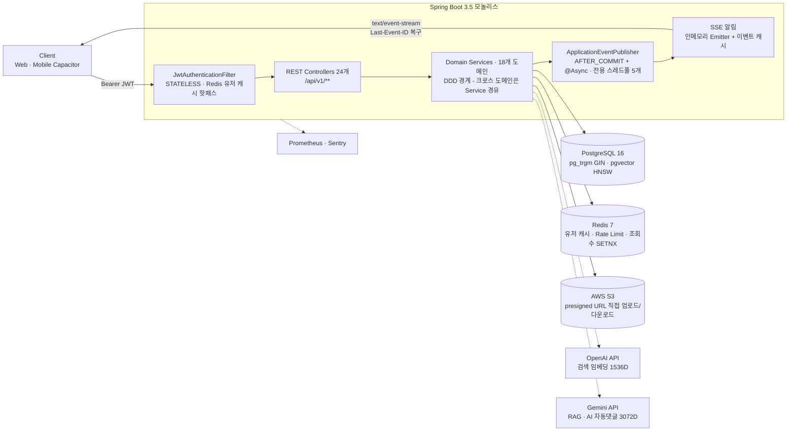

<div align="center">

# MelonMe

### 치료사 전용 커뮤니티 플랫폼 백엔드


치료사 면허 인증을 거친 전문가들이 활동하는 커뮤니티 —
**비즈니스 도메인 18개 · Flyway V1~V52 · REST 엔드포인트 88개 · 테스트 496개**

</div>

---

## 목차

- [프로젝트 목표](#프로젝트-목표)
- [기술 스택](#기술-스택)
- [아키텍처](#아키텍처)
- [도메인 모듈](#도메인-모듈)
- [핵심 기능 상세](#핵심-기능-상세)
- [기술적 이슈 해결 과정](#기술적-이슈-해결-과정)
- [성능 튜닝](#성능-튜닝)
- [테스트](#테스트)
- [실행 방법](#실행-방법)
- [배포 & 운영](#배포--운영)

---

## 프로젝트 목표

- 치료사 면허 인증을 통해 **검증된 전문가만 참여하는 커뮤니티 플랫폼**을 구현합니다.
- 단순 CRUD를 넘어 JWT Refresh Token Family Rotation, SSE 실시간 알림, pg_trgm/pgvector 이중 검색 전략, Gemini RAG 기반 AI 자동댓글, 이벤트 파티셔닝 기반 행동 분석 등 **실무 수준의 기술 과제를 직접 해결**합니다.
- DDD 도메인 경계 원칙, 3계층 테스트 분리, Flyway 마이그레이션, ADR(Architecture Decision Record) 문서화로 **유지보수 가능한 코드베이스**를 만듭니다.

---

## 기술 스택

| 분류 | 기술 |
|------|------|
| Framework | Spring Boot 3.5.10, Spring Security, Spring Data JPA, Spring Data Redis, Spring Retry |
| Language | Java 17 (Gradle) |
| Database | PostgreSQL 16 + pg_trgm(GIN) + pgvector(HNSW), H2 (테스트, PostgreSQL 호환 모드) |
| Cache | Redis 7 (Lettuce), Caffeine (임베딩 쿼리 LRU) |
| Auth | JWT HS256 — Access 30분 / Refresh 14일 (opaque + SHA-256 해시, HttpOnly Cookie, Family Rotation) |
| AI | Spring AI 1.0.0 + OpenAI `text-embedding-3-small` (검색), Gemini `gemini-2.5-flash` · `gemini-embedding-001` (RAG · 자동댓글) |
| Migration | Flyway V1–V52 |
| File Storage | AWS S3 + presigned URL (prod) / Local FileSystem (dev), PDFBox (문서 추출) |
| Observability | Actuator + Micrometer/Prometheus, Sentry, 검색 접근 전용 JSON 로그 (AOP) |
| API Docs | springdoc-openapi 2.8.5 (Swagger UI) |
| CI/CD | GitHub Actions (OIDC) → ECR → EC2 SSM 무중단 배포 |

---

## 아키텍처



### 요청 처리 흐름

1. **인증** — `JwtAuthenticationFilter`(OncePerRequestFilter)가 `Authorization: Bearer` 토큰을 검증합니다. 매 요청마다 유저를 조회하는 핫패스이므로 **Null 캐시 → Redis(`user:{userId}`) → DB** 순서의 Cache-Aside로 DB 부하를 차단합니다. SSE 구독(`/notifications/subscribe`)은 EventSource가 커스텀 헤더를 못 붙이는 제약 때문에 `?token=` 쿼리 파라미터도 허용합니다.
2. **인가** — 역할별 접근 규칙을 메서드 애노테이션이 아닌 `SecurityConfig` 필터체인 한 곳에서 중앙 관리합니다. 역할 체계는 `USER / THERAPIST / ADMIN`이며, 구인공고 목록 등 일부는 비회원에게도 공개됩니다.
3. **처리** — Controller → Service(`@Transactional`) → Repository → PostgreSQL. 응답은 `ApiResponse.success(data)`, 오류는 `CustomException(ErrorCode)` → `GlobalExceptionHandler`(ErrorCode 53종, 5xx는 Sentry 전송)로 일원화됩니다.
4. **부수효과** — 알림·분석·검색 임베딩·AI 댓글은 모두 `@TransactionalEventListener(AFTER_COMMIT)` + `@Async` 이벤트로 분리되어, 본 트랜잭션 롤백 시 실행되지 않고 요청 스레드를 블로킹하지 않습니다.

### 이벤트 기반 비동기 구조 — 전용 스레드풀 5개

게시글 작성 1건이 `EmbeddingEvent`(검색 임베딩) · `PostCreatedEvent`(AI 자동댓글) · `UserEventPayload`(행동 분석) 를 동시에 발행합니다. 도메인 간 결합을 이벤트로 끊고, 작업 성격별로 스레드풀을 격리해 한 기능의 지연이 다른 기능을 침범하지 않게 했습니다.

| Executor | core/max/queue | 담당 | 거부 정책 |
|---|---|---|---|
| `notificationExecutor` | 2 / 4 / 100 | SSE 알림 발송 | LoggingCallerRunsPolicy |
| `analyticsExecutor` | 2 / 8 / 500 | user_events 적재 | LoggingCallerRunsPolicy |
| `embeddingExecutor` | 2 / 4 / 50 | 검색 임베딩 생성 | CallerRunsPolicy |
| `aiCommentExecutor` | 1 / 2 / 50 | AI 자동댓글 생성 | CallerRunsPolicy |
| `knowledgeIngestionExecutor` | 1 / 2 / 20 | 지식문서 인제스션 | CallerRunsPolicy |

`LoggingCallerRunsPolicy`는 표준 CallerRunsPolicy가 조용히 발동되는 문제를 보완해, 큐 포화 시 warn 로그와 Micrometer 카운터(`async.executor.caller_runs{executor}`)를 남깁니다.

### 모듈 구성

- **backend** — 메인 모놀리스 (Spring MVC)
- **sse-server** — WebFlux + Redis pub/sub 기반 SSE 전용 서브모듈. 알림 서버의 수평 확장을 대비한 모듈로, 현재 프로덕션 알림은 모놀리스 인-프로세스 SSE로 동작합니다.

---

## 도메인 모듈

base package: `com.therapyCommunity_Vol1.backend`

| 도메인 | 패키지 | 설명 |
|--------|--------|------|
| auth | `auth/` | 회원가입 · 로그인 · 로그아웃 · JWT 갱신 (Refresh Token Family Rotation) |
| user | `user/` | 프로필, 역할 관리 (USER / THERAPIST / ADMIN) |
| post | `post/` | 게시글 (COMMUNITY / RESOURCE / CONCERN_CARD), 이미지·영상·첨부, 검색 전략, 피드 |
| comment | `comment/` | 대댓글 (자기참조 1-depth), soft delete, 스레드 조립 |
| reaction | `reaction/` | 게시글·댓글 공통 반응 3종 (LIKE / CURIOUS / USEFUL), enum 확장형 설계 |
| scrap | `scrap/` | 게시글 북마크 |
| follow | `follow/` | 치료사 팔로우, 팔로워 전용 가시성 정책, Facade로 순환의존 해결 |
| message | `message/` | 1:1 쪽지 + 관리자 broadcast, 양방향 독립 soft delete |
| notification | `notification/` | SSE 실시간 알림 10종, Last-Event-ID 유실 복구 |
| jobpost | `jobpost/` | 구인공고, 마감일 방향성 커서 피드, 상시모집 sentinel |
| autocomment | `autocomment/` | Gemini RAG 기반 AI 자동댓글, 관리자 검수(승인/거절) 워크플로 |
| knowledge | `knowledge/` | 지식베이스 — PDF/텍스트 추출 → 청킹 → 벡터 임베딩 (RAG 원천) |
| analytics | `analytics/` | user_events 월별 파티셔닝, 시간별 롤업, 치료사 전문성 통계 집계 |
| therapist | `therapist/` | 치료사 면허 인증 워크플로 (PENDING → APPROVED / REJECTED → 재신청) |
| admin | `admin/` | 인증 심사, AI 댓글 검수·토글, 임베딩 백필, 지식문서 관리 |
| application | `application/` | MyPage Facade (user + post + comment + follow 집계) |
| file | `file/` | FileStorageService 추상화 — S3(prod) / Local(dev) 자동 전환, presigned URL |
| meta | `meta/` | 홈, 약관 |
| global | `global/` | Security, 캐시, 예외, 이벤트, 스레드풀, Feature Flag, BaseEntity, ApiResponse |

---

## 핵심 기능 상세

### 검색 — 전략 패턴으로 GIN ↔ pgvector 무중단 전환

`PostSearchStrategy` 인터페이스 아래 두 구현체를 두고, `app.search.strategy` 프로퍼티 하나로 전환합니다.

- **`GinTrigramSearchStrategy`** (기본) — PostgreSQL `pg_trgm` + GIN 인덱스. `word_similarity()` / `<%` 연산자로 오타에 강한 글자 유사도 검색. `SET LOCAL`로 threshold(0.1)를 트랜잭션 스코프에만 적용해 전역 오염을 방지합니다.
- **`PgVectorSearchStrategy`** — OpenAI `text-embedding-3-small`(1536차원) + pgvector HNSW 인덱스. "화남"으로 검색해도 "분노 감정" 글을 찾는 의미 기반 검색. `SET LOCAL hnsw.ef_search = 100`으로 recall을 튜닝하고, 첫 페이지 결과가 3건 미만이면 min-score를 0.2로 완화해 재검색하는 폴백을 갖췄습니다.

두 전략 모두 `SearchResultAssembler`에 조립을 위임합니다. native SQL로 ID+score만 조회한 뒤 작성자 fetch join으로 재조회하는 **2단계 fetch**로, JOIN 시 스코어 정렬이 깨지는 문제와 N+1을 동시에 해결했습니다.

**임베딩 파이프라인**: 게시글 생성/수정 → `AFTER_COMMIT` 이벤트 → Spring AI로 임베딩 생성 → native UPDATE. 검색어는 반복되지만 게시글 본문은 고유하므로, Caffeine 캐시(500건, 1시간)를 **검색어 전용**으로만 사용해 캐시 오염을 막았습니다. 실패 건은 `embedding_failed_at`으로 마킹하고 관리자 백필 API(`/admin/embeddings/backfill`)가 OpenAI rate limit(~10req/s)을 지키며 재처리합니다.

### AI 자동댓글 — Gemini RAG 파이프라인

게시글 작성 시 `requestAutoComment=true`면 `post_ai_comment_jobs`에 job을 적재하고, `AFTER_COMMIT` 이벤트 + 60초 폴링 스케줄러가 이중으로 처리합니다.

1. 게시글 본문 → Gemini 임베딩(`gemini-embedding-001`, 3072차원)
2. 지식베이스에서 치료영역 우선 코사인 유사도 검색 (topK 5)
3. 최상위 score ≥ 0.3이면 **RAG 모드**(근거 청크 포함), 미만이면 **FALLBACK 모드**(일반 조언)
4. `gemini-2.5-flash`로 댓글 초안 생성 → `PENDING_REVIEW` 저장
5. 관리자가 승인하면 시스템 AI 계정("Melonne AI")으로 실제 댓글 등록 + 알림 발행

429/5xx/timeout은 **1분 → 5분 → 30분 지수 백오프**로 최대 4회 재시도하고, 4xx는 즉시 실패 처리합니다. 기능 on/off는 `feature_flags` 테이블 기반 런타임 토글이라 **재배포 없이** 관리자 API로 제어됩니다.

### 지식베이스 — RAG의 원천 데이터

관리자가 PDF/TXT/MD/HTML 문서를 업로드하면 SHA-256 체크섬으로 중복을 차단하고, 비동기 인제스션 파이프라인이 **추출(PDFBox) → 슬라이딩 윈도우 청킹(1000자, overlap 200) → 청크별 Gemini 임베딩 → pgvector 저장**을 수행합니다. 재처리 시 기존 청크를 삭제 후 재생성하는 멱등 설계이며, 실패 문서는 수동 retry 엔드포인트로 재인입할 수 있습니다.

Gemini 임베딩은 3072차원이라 pgvector 인덱스(2000차원 제한)를 걸 수 없어, MVP 규모에서는 **의도적으로 sequential scan을 허용**했습니다 — 검색용 OpenAI 1536차원 + HNSW와 대비되는 트레이드오프 결정입니다.

### 실시간 알림 — SSE

- **다중 탭 지원**: `ConcurrentHashMap<userId, ConcurrentHashMap<emitterId, SseEmitter>>` 중첩 구조로 사용자당 최대 5개 연결을 유지하고, 초과 시 가장 오래된 연결을 정리합니다.
- **유실 복구**: 이벤트를 사용자별 큐(최대 50건, TTL 30분)에 캐싱하고, 재연결 시 `Last-Event-ID` 헤더 기준으로 누락분을 재전송합니다.
- **전송 보장**: 알림 저장은 `REQUIRES_NEW` + `@Retryable`(3회, 500ms 백오프)로 처리하고, 30초 하트비트로 죽은 연결을 감지합니다.
- 알림 10종: 댓글/대댓글, 게시글·댓글 반응, 스크랩, 인증 신청/승인/반려, 팔로우, 쪽지.

### 인증 — JWT + Refresh Token Family Rotation

- **Access Token**: JWT HS256, 30분, 응답 body 전달.
- **Refresh Token**: JWT가 아닌 **opaque 토큰**(SecureRandom 48바이트). DB에는 SHA-256 해시만 저장하고, 원본은 HttpOnly Secure 쿠키(`path=/api/v1/auth`)로만 전달됩니다.
- **탈취 감지**: 같은 기기/세션의 토큰을 `token_family`(UUID)로 묶고, 이미 폐기된 토큰으로 갱신 요청이 오면 해당 family 전체를 `REUSE_DETECTED`로 일괄 폐기합니다.
- **로그인 보호**: Redis 기반 실패 카운터로 10회 실패 시 30분 잠금(429). 이메일 존재 여부와 무관하게 동일 동작해 계정 열거 공격을 차단합니다.

### 피드 — 커서 페이지네이션 + 인기도 점수

- **size+1 트릭**: count 쿼리 없이 요청 크기+1건을 조회해 `hasNext`를 판별합니다.
- **이중 커서**: 최신순은 `(createdAt, id)`, 인기순은 `(popularityScore, id)` — 정렬 키별 커서 구조와 partial index(`WHERE deleted_at IS NULL`)를 분리했습니다.
- **인기도 공식**: `반응수 × 30 + 스크랩수 × 20 + epoch초 / 8640` — 분자를 10배 스케일해 Long 정수로 만들어 커서 동등비교의 부동소수점 오차를 제거했습니다. 재계산은 반응/스크랩 토글 시 동기 `@EventListener`로 전파됩니다.

### 팔로우 & 게시글 가시성

치료사만 팔로우 대상이 될 수 있고, `FOLLOWERS_ONLY` / `VERIFIED_FOLLOWERS_ONLY` 가시성 게시글은 일반 피드·검색에 절대 노출되지 않으며 팔로잉 피드에서만 보입니다(인스타그램 비공개 계정 모델). PRIVATE 글은 모든 역할이 목록에서 볼 수 있되 USER에게는 미리보기·이미지를 마스킹하고 `accessLocked=true`로 표시합니다.

### 1:1 메시지

`deleted_by_sender` / `deleted_by_receiver` 플래그로 **양방향 독립 soft delete**를 구현했습니다 — 한쪽이 삭제해도 상대방 보관함에는 유지되고, 양쪽 모두 삭제 시 `deleted_at`이 세팅되어 배치 정리 대상이 됩니다. 받은함/보낸함/안읽음 각각 조건부 partial index로 삭제 행을 스캔에서 제외하고, `CHECK (sender_id != receiver_id)` DB 제약으로 애플리케이션 검증을 이중화했습니다. 관리자 broadcast는 `broadcast_id`(UUID)로 그룹 추적됩니다.

### 구인공고

마감 상태를 컬럼으로 저장하지 않고 `deriveStatus(today)`로 파생시키며, 상시모집은 `9999-12-31` sentinel 마감일로 표현합니다. OPEN 피드는 `deadline ASC`(마감 임박순), CLOSED 피드는 `deadline DESC`로 **방향이 다른 커서**를 쓰고, 핫패스인 OPEN 피드에만 partial index(`WHERE deleted_at IS NULL AND closed_manually = false`)를 걸었습니다.

### 사용자 행동 분석 — 파티셔닝 + 통계 집계

- **수집**: 조회/반응/스크랩/댓글/다운로드 이벤트를 `AFTER_COMMIT` + `REQUIRES_NEW`로 적재 — 분석 실패가 본 작업에 영향을 주지 않습니다.
- **파티셔닝**: `user_events`는 월별 RANGE 파티션. 매월 1일 스케줄러가 3개월치 파티션을 선제 생성해 INSERT 유실을 방지합니다.
- **집계**: 매시 5분에 `post_hourly_stats` 롤업(`COUNT(*) FILTER`로 10종 카운트를 1쿼리에), 매일 00:15에 치료사 전문성 점수를 CTE 체인(log 정규화 → z-score → Laplace smoothing Beta(1,9) → 가중합 → PERCENT_RANK)으로 산출합니다.
- **멱등성**: 각 구간을 DELETE → INSERT로 완전 재계산하고, `aggregation_progress` 커서를 PESSIMISTIC_WRITE로 잠가 다중 인스턴스 중복 실행을 막습니다.

---

## 기술적 이슈 해결 과정

### 검색 · AI

- **[#1] Elasticsearch 없이 관련도 기반 검색을 구현하는 문제**
  PostgreSQL `pg_trgm` + GIN 인덱스만으로 검색을 구현하되, 긴 search_text에서 `similarity()` 점수가 무너지는 문제를 `word_similarity()` / `<%` 전환(threshold 0.03→0.1)으로 해결했습니다. 또한 `LOWER()` 함수 래핑이 `gin_trgm_ops` 인덱스를 무효화하는 것을 발견해 소문자 저장 컬럼 + bare LIKE로 인덱스 활용을 보장했습니다.

- **[#2] HNSW 인덱스를 만들었는데 플래너가 쓰지 않는 문제**
  `ORDER BY score DESC`(alias 정렬) + WHERE 스코어 필터 조합에서는 pgvector HNSW 인덱스가 타지 않고 Seq Scan이 발생했습니다. `ORDER BY p.content_embedding <=> CAST(:q AS vector)`로 raw 연산자 정렬로 바꾸고 NextPage 서브쿼리를 제거해 Index Scan을 유도, O(N)→O(log N)으로 개선했습니다.

- **[#3] 임베딩 쿼리 캐시가 게시글 본문으로 오염되는 문제**
  검색어는 반복되지만 게시글 본문은 1회성이라 같은 캐시를 쓰면 LRU가 본문으로 밀려납니다. `embed()`(Caffeine 캐시)와 `embedWithoutCache()`(본문 전용)를 분리해 검색어 캐시 적중률을 지켰습니다.

- **[#4] 3072차원 임베딩은 pgvector 인덱스를 걸 수 없는 문제**
  Gemini 임베딩(3072차원)은 ivfflat/hnsw의 2000차원 제한을 초과합니다. 지식베이스는 데이터 규모가 작아 sequential scan을 의도적으로 허용하고, 대규모인 게시글 검색은 OpenAI 1536차원 + HNSW로 분리하는 이원화 결정을 내렸습니다.

### 동시성 · 안정성

- **[#5] 스케줄러와 이벤트 리스너가 같은 job을 중복 처리하는 문제**
  AI 댓글·지식 인제스션은 `AFTER_COMMIT` 즉시 처리와 60초 폴링이 공존합니다. 폴러는 `FOR UPDATE SKIP LOCKED`로 잠긴 행을 건너뛰고, 처리 직전 `PESSIMISTIC_WRITE` 재조회 + 종료상태 재확인으로 중복 실행을 차단했습니다.

- **[#6] 자기호출 시 @Transactional이 무시되는 AOP 함정**
  `@Scheduled` 메서드가 같은 빈의 `@Transactional` 메서드를 호출하면 프록시를 우회합니다. `@Lazy` self-injection으로 프록시를 경유시키고, 임베딩 실패 마킹은 `EmbeddingFailureRecorder` 별도 빈(`REQUIRES_NEW`)으로 분리했습니다.

- **[#7] 트랜잭션 커밋 이후에만 알림을 전송해야 하는 문제**
  `@TransactionalEventListener(AFTER_COMMIT)` + `@Async` 전용 스레드풀로 롤백 시 알림 미발송을 보장하면서 요청 스레드를 블로킹하지 않았습니다. 알림 저장 자체는 `REQUIRES_NEW` + `@Retryable`로 일시 장애에 대비했습니다.

- **[#8] SSE 다중 탭 지원과 유실 이벤트 복구**
  사용자당 emitter 맵을 중첩 ConcurrentHashMap으로 관리해 N개 탭을 동시 지원하고, `Last-Event-ID` 기반 재연결 시 캐시된 이벤트(50건/30분)를 자동 재전송했습니다.

- **[#9] Redis 장애 시 핵심 기능이 차단되는 문제**
  모든 Redis 연동을 try-catch로 감싸 장애 시 DB 직접 조회/기능 허용으로 graceful degradation 했습니다. 유저 캐시는 TTL jitter(1800+rand(300)초)로 cache avalanche를, null 캐싱(60초)으로 cache penetration을 방지합니다. Lettuce 타임아웃(command 2s, connect 1s)으로 핫패스 무한 대기도 차단했습니다.

- **[#10] Follow 도입으로 발생한 순환 참조 기동 실패**
  `PostService → VisibilityPolicy → FollowService → ScrapService → PostService` 순환으로 `BeanCurrentlyInCreationException`이 발생했습니다. 이벤트 분리·Repository 직접 참조 대안을 검토한 끝에 **Facade 패턴**을 채택 — unfollow 오케스트레이션만 `FollowFacade`로 분리해 고리를 끊었습니다(ADR-001).

### 성능

- **[#11] 피드 조회 N+1 — 요청당 쿼리 43개**
  게시글마다 반응/댓글 수를 개별 count하던 것을 `countByPostIdIn` 배치 쿼리 + Map join으로 전환해 **요청당 JDBC statement 43개 → 4개(-90.7%), p95 345ms → 50ms(-85.5%), 처리량 121 → 392 req/s(+223%)** 를 달성했습니다(k6 실측, posts 10만 건 데이터셋).

- **[#12] 커서 페이지네이션의 부동소수점 동등비교 오차**
  인기도 점수 공식의 분자를 10배 스케일해 Long 정수(`반응수*30 + 스크랩수*20 + epoch/8640`)로 만들어 커서 비교의 완전한 동등성을 보장했습니다.

- **[#13] append-only 이벤트 테이블의 무한 성장**
  `user_events`를 월별 RANGE 파티셔닝(PK `(id, occurred_at)`)하고 파티션 자동 선제 생성 + 오래된 파티션 DROP으로 보존 관리와 파티션 프루닝을 확보했습니다. 집계는 DELETE→INSERT 멱등 재계산이라 크래시 후 재실행에도 안전합니다.

### 보안

- **[#14] Refresh Token 탈취 시나리오 방어**
  opaque 토큰의 SHA-256 해시만 DB에 저장하고, `token_family` 단위 rotation으로 폐기된 토큰 재사용을 감지하면 family 전체를 일괄 폐기합니다. 로그인은 Redis rate limit(10회/30분 잠금), 조회수는 `SETNX` 30분 TTL로 세션 없이 중복을 차단합니다.

---

## 성능 튜닝

### N+1 제거 실측 (k6, 30 VU × 60s, posts 100k · reactions 7M 데이터셋)

| 지표 | Before | After | 개선 |
|---|---|---|---|
| 요청당 JDBC statements | 43 | 4 | -90.7% |
| p95 응답시간 | 344.95ms | 49.85ms | -85.5% |
| median 응답시간 | 175.29ms | 22.06ms | -87.4% |
| 처리량 | 121 req/s | 392 req/s | +223% |

### 커넥션 풀 · 스레드 튜닝 설계 (EC2 t3.small + RDS t3.micro 실측 역산)

임의의 숫자를 정하지 않고 라이브 실측값(피크 ~14 rps, 풀 상태 active 0 / idle 10 / pending 0)에서 역산한 튜닝 설계를 [docs/perf/connection-pool-and-thread-tuning.md](docs/perf/connection-pool-and-thread-tuning.md)에 정리했습니다.

| 항목 | 기본값 → 목표값 | 근거 |
|---|---|---|
| Hikari pool | 10 고정 (min=max) | `(2 vCPU × 2) + 1 ≈ 5`의 2배, RDS max_connections 81을 dev/prod가 공유 |
| Hikari connection-timeout | 30s → 3s | 풀 고갈 시 fail-fast로 장애 격리 |
| Hikari max-lifetime | 30분 → 29분 | 인프라 idle timeout보다 먼저 갱신해 죽은 커넥션 방지 |
| Tomcat max threads | 200 → 50 | 스레드 스택 메모리 ~150MB 절감, 피크 ~14rps에 충분 |
| Lettuce timeout (적용됨) | command 2s / connect 1s | 캐시 핫패스 무한 대기 방지 |

k6 시나리오 4종(feed / search / detail / reaction 토글)과 재현 가능한 시드 스크립트(`setseed(0.42)`, posts 1만 건)는 `docs/perf/`에 있습니다.

---

## 테스트

테스트 파일 **82개, 테스트 메서드 496개**를 3계층으로 분리했습니다.

- **통합** (`@SpringBootTest`) — 컨텍스트 로딩, 메시지 동시성, 알림 재시도 등 트랜잭션·동시성이 핵심인 시나리오
- **슬라이스** (`@DataJpaTest`, MockMvc standalone) — 커서 리포지토리 쿼리, 컨트롤러 검증/직렬화
- **단위** (Mockito, 순수 Java) — 서비스 로직, 도메인 규칙, 커서 인코딩, 검색 전략

테스트 DB는 H2 PostgreSQL 호환 모드(`MODE=PostgreSQL`)를 사용하고, 외부 API(OpenAI 등)는 자동설정 제외로 격리합니다.

```bash
./gradlew test
```

---

## 실행 방법

```bash
# 1. 인프라 실행 (PostgreSQL 16 + pgvector, Redis 7)
cp .env.example .env
docker compose up -d

# 2. 애플리케이션 실행
./gradlew bootRun --args='--spring.profiles.active=local'

# 3. 빌드
./gradlew clean build
```

---

## 배포 & 운영

### CI/CD — 무중단 배포

`main` 푸시 → 스테이징, `deploy` 푸시 → 프로덕션. GitHub Actions가 OIDC로 AWS 자격을 얻어 ECR에 이미지를 푸시하고, SSM Run Command로 EC2에서 배포합니다. 신규 컨테이너를 8081 포트에 먼저 띄워 `/actuator/health` 헬스체크(최대 12회)를 통과한 뒤 8080으로 교체하는 방식으로 다운타임을 제거했습니다. 시크릿은 AWS Secrets Manager / SSM Parameter Store에서 주입됩니다.

### Observability

- **Prometheus**: `/actuator/prometheus` 노출. 커스텀 메트릭 — SSE 활성 사용자/캐시(`sse.*`), 알림 실패 원인별(`notification.failure{cause}`), 스레드풀 포화(`async.executor.caller_runs{executor}`)
- **Sentry**: 5xx 예외 자동 수집 (환경별 태깅)
- **검색 접근 로그**: AOP가 검색 요청마다 keyword/결과 수/응답시간/zero-result 여부를 JSON으로 별도 파일에 기록 (일별 롤링 30일) — pgvector 도입 판단의 데이터 근거로 활용
- **헬스체크**: DB/Redis 인디케이터를 의도적으로 비활성화해, 의존 인프라 장애가 애플리케이션 헬스체크 실패(→ 재시작 루프)로 번지지 않게 했습니다.

---

## 문서

설계 결정과 트러블슈팅 전 과정은 `docs/`에 기록되어 있습니다. 핵심 문서: [ARCHITECTURE.md](docs/architecture/ARCHITECTURE.md) · [DEPENDENCY_ARCHITECTURE.md](docs/architecture/DEPENDENCY_ARCHITECTURE.md) · [API_SPEC.md](docs/api/API_SPEC.md) · ADR([decisions/](docs/decisions/)) · 벡터 검색 진단 20편([vector/diagnostic/](docs/vector/diagnostic/)) · 성능 실측([perf/](docs/perf/))
