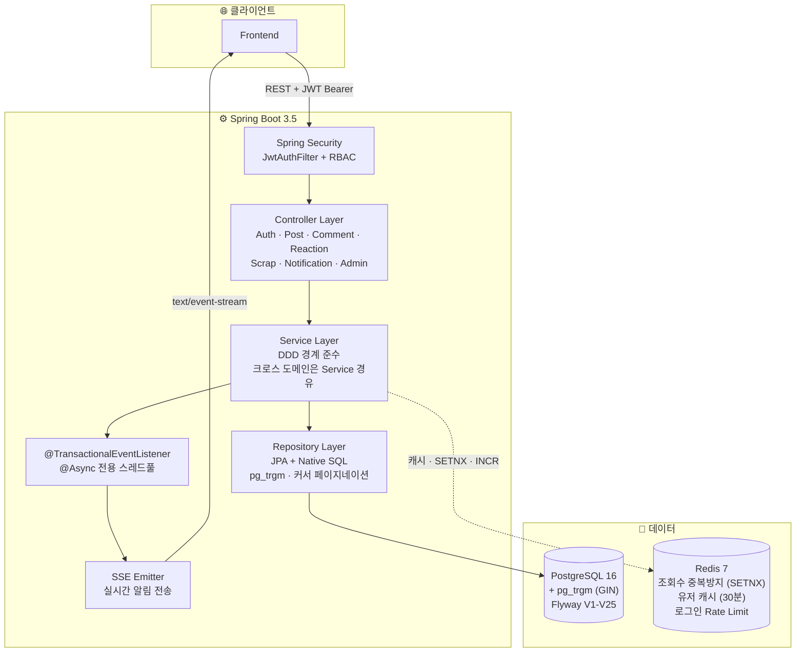
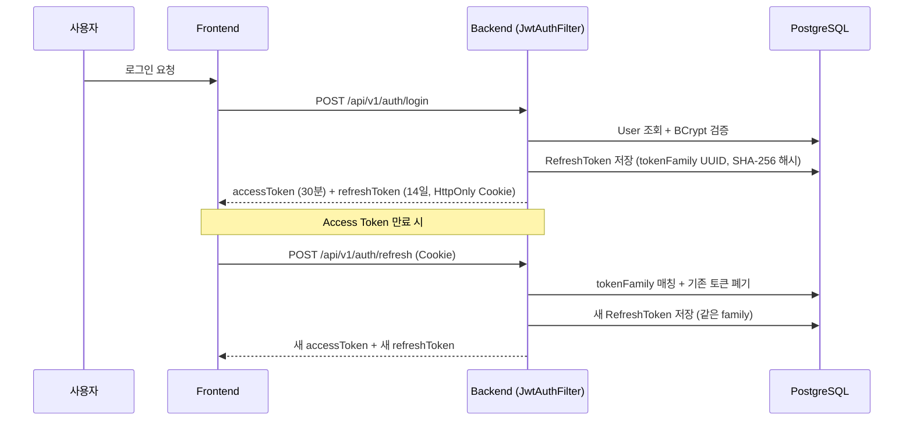

<div align="center">

# 🍈 MellonMe

### 치료사 전용 커뮤니티 플랫폼 — 인기순 피드, 관련도 검색, 실시간 알림


</div>

---

## 1. Claude Code 워크플로우 설계

본 프로젝트는 **Claude Code 멀티에이전트 워크플로우**를 활용하여 9개 도메인을 병렬로 설계/구현했습니다.

### 1-1. 계층형 CLAUDE.md 컨텍스트 분리

```
CLAUDE.md (루트)
├── 프로젝트 개요, 기술 스택, 12개 도메인 모듈 맵
├── Key Conventions (Response 포맷, Entity/Service/DTO 규칙)
└── DDD 도메인 경계 원칙: Repository는 해당 도메인 내부 구현,
    크로스 도메인 접근은 반드시 상대 도메인의 Service 경유
```

에이전트가 작업 시 **루트 CLAUDE.md만 읽으면** 엔티티 규칙, 서비스 트랜잭션 규칙, DTO 팩토리 패턴, 에러 처리 방식을 즉시 파악합니다.
도메인별 상세 컨텍스트는 slash command로 필요할 때만 주입하여 **토큰 소비를 최소화**했습니다.

### 1-2. Slash Commands — 도메인 탐색 + 코드 생성 + 커밋 자동화

`.claude/commands/` 에 **17개 커맨드**를 구축하여, 에이전트가 매번 파일을 탐색하지 않고 즉시 컨텍스트를 확보합니다.

| 분류 | 커맨드 | 역할 |
|------|--------|------|
| **도메인 탐색** (12) | `/auth`, `/user`, `/post`, `/comment`, `/reaction`, `/scrap`, `/therapist`, `/admin`, `/global`, `/file`, `/notification`, `/test` | 해당 도메인의 파일 경로, 엔티티 구조, 서비스 메서드, ErrorCode를 프롬프트로 주입 |
| **코드 생성** (4) | `/new-domain`, `/new-endpoint`, `/new-errorcode`, `/new-migration` | CLAUDE.md 컨벤션에 맞춰 boilerplate 자동 생성 (DTO validation, Swagger 어노테이션, 팩토리 메서드 포함) |
| **커밋 자동화** (1) | `/commit` | 변경사항을 분석하여 **논리적 변경 단위**로 자동 분류 → 커밋 계획 제시 → 승인 후 순서대로 커밋 & 푸시 |

### 1-3. Pre-commit Hook — 시크릿 유출 자동 차단

`.claude/settings.json`에 **PreToolUse 훅**을 설정하여, `git commit` 실행 시:
- `application-local.yaml` 스테이징 감지 → **커밋 차단**
- staged diff에서 `password|secret|key` 하드코딩 패턴 감지 → **커밋 차단**

에이전트가 실수로 시크릿이 포함된 파일을 커밋하는 것을 원천 방지합니다.

### 1-4. PROGRESS.md 기반 세션 인수인계

SubAgents가 도메인별 작업을 완료하면 `PROGRESS.md`에 진행 상태를 기록합니다.
세션이 종료되거나 Team Agent로 전환될 때, **코드를 다시 탐색하지 않고** PROGRESS.md만 읽어 즉시 통합 작업에 진입합니다.

---

## 2. 주요 기능

### 2-1. 관련도 검색 (pg_trgm + GIN 인덱스)

Elasticsearch 없이 **PostgreSQL pg_trgm 확장**만으로 관련도 기반 검색 파이프라인을 구축했습니다.

**검색 텍스트 통합 컬럼**
```sql
-- title + content(앞 100자) + therapyArea(한글) + ageGroup(한글)을 통합
ALTER TABLE therapy_posts ADD COLUMN search_text TEXT;
CREATE INDEX idx_therapy_posts_search_text_trgm
    ON therapy_posts USING GIN (search_text gin_trgm_ops);
```

**관련도 점수 + ILIKE 병렬 조건**
```sql
SELECT p.id, CAST(similarity(p.search_text, :keyword) AS numeric(10,8)) AS score
FROM therapy_posts p
WHERE p.deleted_at IS NULL
  AND (p.search_text % :keyword OR p.search_text ILIKE '%' || :escapedKeyword || '%')
ORDER BY score DESC, p.id DESC
```

| 설계 포인트 | 내용 |
|------------|------|
| **similarity + ILIKE 병렬** | trigram 유사도가 낮아도 정확한 부분 매칭은 검색 결과에 포함 |
| **numeric(10,8) 캐스팅** | 부동소수점 오차 방지 → BigDecimal 커서 동등비교 정확성 보장 |
| **SET LOCAL** | `pg_trgm.similarity_threshold = 0.03` 트랜잭션 스코프 설정 → 전역 오염 회피 |
| **2단계 Fetch** | 1단계: native SQL로 (ID, score)만 조회 → 2단계: author 포함 fetch (N+1 회피) |
| **커서 페이지네이션** | `(lastScore, lastId)` 쌍으로 무한스크롤 지원 |

### 2-2. 인기순 피드 무한스크롤

반응/스크랩 가중치 기반 **인기도 점수**를 실시간 갱신하고, 커서 기반 페이지네이션으로 무한스크롤을 제공합니다.

**점수 공식**
```
popularityScore = reactions × 30 + scraps × 20 + (created_at epoch / 8640)
```

| 설계 포인트 | 내용 |
|------------|------|
| **Long 타입 + 10배 스케일** | 부동소수점 커서 동등비교 오차 방지 (원래 3/2/86400 → 30/20/8640) |
| **복합 커서** | `(popularityScore DESC, id DESC)` — 동점 시 최신 글 우선 |
| **실시간 갱신** | 반응/스크랩 토글 시 `recalculatePopularityScore()` 즉시 호출 |
| **DDD 경계 준수** | reaction/scrap 서비스 → `PostService.recalculatePopularityScore()` 위임 (Repository 직접 접근 금지) |
| **flushAutomatically** | `@Modifying(flushAutomatically = true)` — delete 후 COUNT 서브쿼리가 이전 값을 읽는 문제 방지 |
| **createPost 최적화** | 새 글은 reaction=0, scrap=0이므로 엔티티 생성자에서 `epoch/8640` 기본값 설정 → COUNT 서브쿼리 생략 |

### 2-3. SSE 실시간 알림

**Spring Event + SSE**로 트랜잭션 커밋 후 비동기 알림을 전송합니다.

**이벤트 발행 → 구독 흐름**
```
반응/댓글/스크랩 서비스
  → ApplicationEventPublisher.publishEvent(NotificationEvent)
    → @TransactionalEventListener(AFTER_COMMIT)
      → @Async("notificationExecutor") 전용 스레드풀 (core 2, max 4, queue 100)
        → DB 저장 + SSE 전송 + 이벤트 캐시
```

| 설계 포인트 | 내용 |
|------------|------|
| **8가지 알림 타입** | NEW_COMMENT, NEW_REPLY, NEW_POST_REACTION, NEW_COMMENT_REACTION, NEW_SCRAP, VERIFICATION_SUBMITTED/APPROVED/REJECTED |
| **다중 탭 지원** | `ConcurrentHashMap<userId, ConcurrentHashMap<emitterId, SseEmitter>>` — 사용자당 여러 브라우저 탭 동시 관리 |
| **유실 이벤트 복구** | `Last-Event-ID` 헤더 기반 — 네트워크 끊김 후 재연결 시 누락된 이벤트 자동 재전송 |
| **이벤트 캐시** | `ConcurrentLinkedQueue<CachedEvent>` 최대 50개, TTL 30분, 5분 주기 정리 |
| **AFTER_COMMIT** | 트랜잭션 롤백 시 알림이 발송되지 않도록 커밋 후에만 이벤트 처리 |

**REST API**

| Method | URL | 설명 |
|--------|-----|------|
| GET | `/notifications/subscribe` | SSE 구독 (text/event-stream, 30분 타임아웃) |
| GET | `/notifications` | 알림 목록 조회 (페이징) |
| GET | `/notifications/unread-count` | 미읽은 알림 수 |
| PATCH | `/notifications/{id}/read` | 단건 읽음 처리 |
| PATCH | `/notifications/read-all` | 전체 읽음 처리 |
| DELETE | `/notifications/{id}` | 알림 삭제 |

### 2-4. Redis 기반 조회수 중복 증가 방지

```
Key:   post_view:{postId}:{userId}
TTL:   30분 (1800초)
방식:  SETNX — 키가 없으면 세팅 + 조회수 증가, 있으면 무시
장애:  Redis 다운 시 조회수 증가 허용 (가용성 우선)
```

`LoginAttemptService`(로그인 실패 Rate Limiting)와 동일한 패턴으로 구현하여 프로젝트 내 Redis 사용 패턴을 일관성 있게 유지했습니다.

---

## 3. 아키텍처

### 3-1. 시스템 구성도



### 3-2. 인증 플로우 (JWT + Refresh Token Family Rotation)



- **Family 기반 Rotation**: 같은 기기/세션의 토큰을 `tokenFamily` UUID로 추적, 탈취 감지 시 family 전체 폐기
- **SHA-256 해시 저장**: DB에 원본 토큰 대신 해시만 저장
- **IP/UserAgent 기록**: 이상 접근 탐지 기반 데이터 확보

### 3-3. 도메인 모듈 구조

```
com.therapyCommunity_Vol1.backend
├── auth/          회원가입, 로그인, JWT 발급, Refresh Token 관리
├── user/          프로필, 역할 관리 (USER → THERAPIST 승격)
├── post/          게시글 CRUD, 첨부파일, 관련도 검색, 인기순 피드
├── comment/       스레드형 댓글 (최대 2depth), 소프트 삭제
├── reaction/      확장형 반응 (게시글: 공감/감사/유익, 댓글: 좋아요/싫어요)
├── scrap/         게시글 북마크
├── notification/  SSE 실시간 알림 (8가지 타입)
├── therapist/     치료사 면허 인증 워크플로우
├── admin/         관리자 인증 심사 (Thin Layer)
├── application/   MyPage 파사드 (user + post + comment 집계)
├── file/          파일 저장소 추상화 (S3 prod / Local dev)
├── meta/          홈, 이용약관
└── global/        Security, Cache, Exception, BaseEntity, ApiResponse
```

---

## 4. 역할 기반 접근 제어

| 기능 | USER | THERAPIST | ADMIN |
|------|:----:|:---------:|:-----:|
| PUBLIC 게시글 조회 | O | O | O |
| PRIVATE 게시글 조회/작성 | X | O | O |
| 댓글 · 반응 · 스크랩 | O | O | O |
| 치료사 인증 신청 | O | O | X |
| 인증 심사 (승인/거부) | X | X | O |
| 관리자 API | X | X | O |

---

## 5. 기술적 의사결정

| 결정 | 선택 | 이유 |
|------|------|------|
| 관련도 검색 | pg_trgm + GIN | Elasticsearch 없이 추가 인프라 비용 0으로 초성/텍스트 통합 검색 |
| 인기도 점수 타입 | Long (10배 스케일) | 부동소수점 커서 동등비교 오차 방지 + DB 인덱스 성능 |
| 알림 전송 | SSE (Server-Sent Events) | WebSocket 대비 단방향으로 충분, 구현 간결, HTTP/2 호환 |
| 조회수 중복방지 | Redis SETNX + TTL | 세션/쿠키 불필요, Stateless 유지, 30분 자동 만료 |
| Refresh Token | Family Rotation + SHA-256 | 토큰 탈취 시 family 전체 폐기로 피해 최소화 |
| 도메인 간 통신 | Service 위임 (DDD 경계) | Repository 직접 접근 금지 → 도메인 결합도 최소화 |
