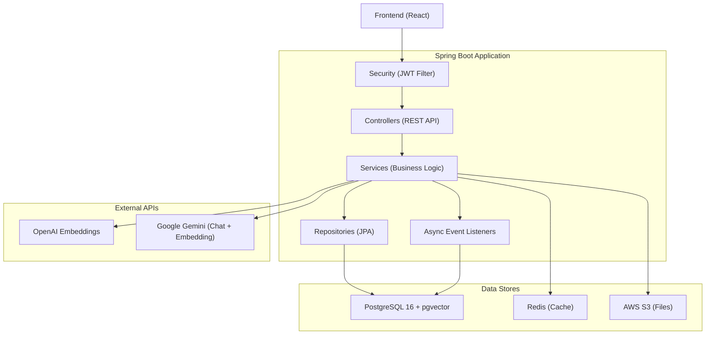
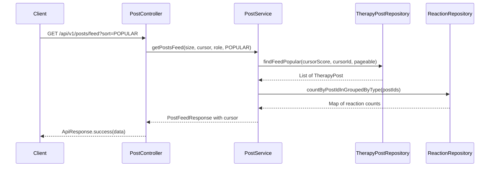

# System Architecture

## System Overview
Spring Boot 3.5 기반 모놀리식 REST API. Java 17, PostgreSQL 16, Redis. JWT 무상태 인증. Flyway 마이그레이션 43개.

## Architecture Diagram

## Component Descriptions

### Controllers Layer
- REST 엔드포인트 노출, 입력 검증, 응답 변환
- `@AuthenticationPrincipal CustomUserDetails`로 인증 컨텍스트 수신

### Services Layer
- 비즈니스 로직, 트랜잭션 관리
- 크로스 도메인 접근은 Service를 통해서만 (Repository 직접 주입 금지)

### Repositories Layer
- Spring Data JPA + 네이티브 쿼리 (pgvector, pg_trgm)
- 커서 기반 페이지네이션 쿼리

### Security
- JWT 인증 필터 (HS256, access 30min, refresh 14d)
- 역할 기반 접근 제어 (SecurityConfig filter chain)

## Data Flow - Post Feed (POPULAR)

## Integration Points
- **PostgreSQL**: 주 데이터 저장소 (pgvector 확장 포함)
- **Redis**: 로그인 시도 제한, 게시글 조회수 캐시, 사용자 프로필 캐시
- **AWS S3**: 첨부파일, 이미지, 프로필 사진 저장 (Presigned URL)
- **OpenAI API**: 텍스트 임베딩 생성 (text-embedding-3-small)
- **Google Gemini**: 임베딩 + AI 댓글 생성 (RAG 파이프라인)
